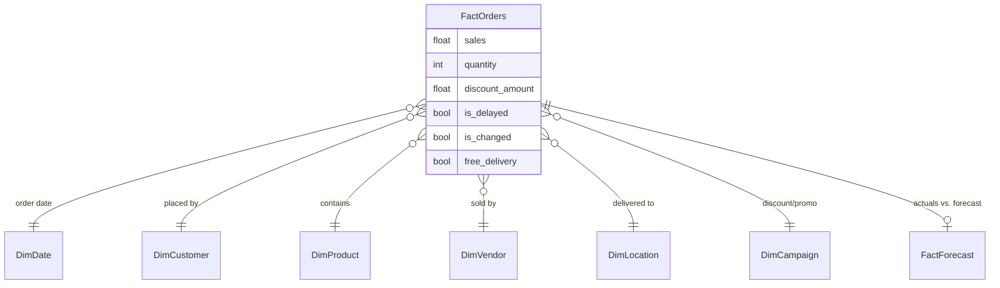

# Power BI Dashboards

A growing collection of Power BI projects — dashboards, reports, and data
models built end-to-end from raw data to interactive, decision-ready
visuals. Each project folder is self-contained: `.pbix` file, sample data,
and its own notes on the metrics and design decisions behind it.

This repo is meant to be browsed project by project rather than read top to
bottom — jump to the one you're interested in below.

## Dashboard Preview

## Table of contents

- [Projects](#projects)
  - [Daily Sales Dashboard — Online Market (Persian)](#daily-sales-dashboard--online-market-persian)
- [Data modeling approach](#data-model)
- [Tech stack](#tech-stack)
- [How to explore a dashboard](#how-to-explore-a-dashboard)
- [About me](#about-me)

## Projects

### Daily Sales Dashboard — Online Market (Persian)

📁 [`/Daily Sales Dashboard – Online market (Persian)`](<./Daily Sales Dashboard – Online market (Persian)>)

Two linked dashboards built on the same order-level dataset for an online
supermarket, aimed at two different audiences: leadership tracking overall
health of the business, and a competitive read on the platform's two store
formats.

#### 1. General Overview Dashboard

Gives business leaders visibility into the metrics that matter day to day,
and surfaces trends that aren't obvious from raw numbers alone.

| Area | What it shows |
|---|---|
| Sales overview | Total sales, total orders, unique customers, average basket value |
| Customer behavior | New vs. returning customers, repeat purchase rate, daily/weekly active users |
| Discount analysis | Sales split by discount type — product discount, coupon, voucher, no discount |
| Operations | % delayed orders, % changed orders, free-delivery usage rate |
| Top performers | Top 10 vendors, top 10 products, revenue by category/sub-category |

**Visuals used:** KPI cards for headline metrics · line charts for sales
trends over time · donut charts for discount-type and customer-segment
breakdowns · bar charts for top vendors/products/supermarket types · a map
visual for city/area-level sales.

#### 2. Competitive Analysis Dashboard (Supermarket Type 1 vs. Type 2)

A head-to-head comparison between the platform's two supermarket formats,
built to answer a specific business question: *what would Type 1 gain by
adopting Type 2's promotion strategy?*

- Compares sales volume and average order value (AOV) between the two types
- Breaks down how coupons, vouchers, and free delivery each contribute to
  revenue for each type
- A scenario-simulation table estimating the revenue uplift for Type 1 if it
  adopted Type 2's coupon / free-delivery approach
- Trend lines showing the before/after effect of a promotion

**Visuals used:** clustered bar/column charts for the Type 1 vs. Type 2
comparison · a stacked area chart for discount-type contribution over time ·
the scenario-simulation table · before/after trend lines.

---

*More dashboards will be added here as separate project folders, following
the same structure: a short brief, the key metrics it answers, and the
`.pbix` file itself.*

## Data model

Dashboards in this repo are built on a conventional star schema rather than
one flat table — it keeps aggregations fast and makes slicing by any
dimension (customer, product, city, promotion, time) cheap instead of
requiring a redesign per question.

- **FactOrders** — one row per order line: sales, quantity, discounts, and
  operational flags (delayed / changed / free delivery).
- **Dimensions** — Date, Customer, Product, Vendor, Location, Campaign.
- **FactForecast** — forecasting output (from an external Python/R pipeline)
  stored alongside actuals so forecast-vs-actual comparisons are a native
  part of the model rather than a separate report.

All measures are written as explicit DAX (not implicit/auto-sum
aggregations) for consistency and easier debugging as the model grows.

## Tech stack

- **Power BI Desktop** — data modeling, DAX measures, report design
- **Power Query (M)** — data cleaning and shaping on load
- **Star schema** dimensional modeling
- Source data as CSV/Excel exports (see each project folder for its
  specific dataset)

## How to explore a dashboard

1. Install [Power BI Desktop](https://powerbi.microsoft.com/desktop/) (free).
2. Open the `.pbix` file inside the relevant project folder.
3. Use the slicers/filters on each page to drill into a specific time
   range, city, vendor, or promotion type.
4. Check the **Model** view (left-hand sidebar in Power BI Desktop) to see
   the star schema and DAX measures behind the visuals.

## About me

I'm a BI engineer working across Power BI, DAX, Power Query, SQL Server,
SSIS/SSAS, and Python. More projects and write-ups at
[miladshabani.ir](https://miladshabani.ir).

## License

MIT — see [LICENSE](LICENSE). Sample datasets included in each project
folder are anonymized/synthetic and provided for demonstration only.
